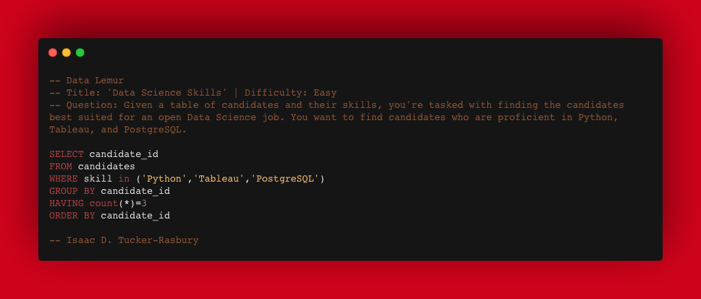

# Practicing SQL w/ Isaac D. Tucker-Rasbury via DataLemur
Using this as a space to log and organize my SQL practice using the website [DataLemur](https://datalemur.com). Hope you can learn something from this space as well!

## About this Repository
Being a data analyst means keeping my skills sharp. Herein, I log my SQL queries that I've been practicing while going through the exercises on DataLemur.com, a relatively new website where anyone can practice their SQL. Some of these entries will have a accompanying LinkedIn posts and commentary, and I hope you follow those links and learn a bunch as you read along. Given this site has 50-70 questions and that I am doing these at my leisure, this repository will be updated as I go through them, ie. will be updated over time.

Thanks for visiting my portfolio!

## How the entries are logged
 - Question Title | Difficulty | Company Question is From | Date Completed
 - Question 
 - Code Answer
 - Number of Tries
 - Lessons learned, new skills practiced, and notable failures
 - LinkedIn posts about respective question, if applicable

## Table of Contents

### Easy Questions
- [Data Science Skills | Easy | LinkedIn | 10/12/2022](https://github.com/TuckerRasbury/SQLPractice_Datalemur_ITR#data-science-skills--easy--linkedin--10122022)
- [Pages with No Likes | Easy | Facebook | 9/13/2022](https://github.com/TuckerRasbury/SQLPractice_Datalemur_ITR#pages-with-no-likes--easy--facebook--9132022)
- [Cities with Completed Trades | Easy | Robinhood | 9/12/2022](https://github.com/TuckerRasbury/SQLPractice_Datalemur_ITR#cities-with-completed-trades--easy--robinhood--9122022)

### Medium
- [Placeholder]()

### Hard
- [Placeholder]()
 
## Question Responses
_Note: Questions ordered by date._

### Data Science Skills | Easy | LinkedIn | 10/12/2022
- Question: Given a table of candidates and their skills, you're tasked with finding the candidates best suited for an open Data Science job. You want to find candidates who are proficient in Python, Tableau, and PostgreSQL. **Write a SQL query to list the candidates who possess all of the required skills for the job. Sort the the output by candidate ID in ascending order.**

- Number of Tries: 2
- Lessons Learned: I learned about and practiced using the IN function with the WHERE subclause. The IN function is fairly new to me.
- LinkedIn Post: [Here](https://www.linkedin.com/posts/tuckerrasbury_dataanalyst-sql-growthmindset-activity-6985986546453622784-alHY?utm_source=share&utm_medium=member_desktop)

### Pages with No Likes | Easy | Facebook | 9/13/2022
- Question: Assume you are given the tables below about Facebook pages and page likes. **Write a query to return the page IDs of all the Facebook pages that don't have any likes. The output should be in ascending order.**

- Number of Tries: 2
- Lessons Learned: HAVING vs WHERE 

“A HAVING clause is like a WHERE clause, but applies only to groups as a whole (that is, to the rows in the result set representing groups), whereas the WHERE clause applies to individual rows. A query can contain both a WHERE clause and a HAVING clause.” [🔗 Microsoft Documentation Link  🔗](https://learn.microsoft.com/en-us/sql/ssms/visual-db-tools/use-having-and-where-clauses-in-the-same-query-visual-database-tools?view=sql-server-ver16#:~:text=A%20HAVING%20clause%20is%20like,clause%20and%20a%20HAVING%20clause)

This one was more challenging for me since I am generally used to painting in broad strokes. Both clauses allow you to filter the broader dataset. The trick-for me at least is that they do the same thing BUT UNDER DIFFERENT circumstances! I tried to answer the question with both because I refused to accept the difference, but ultimately landed back where I started, ie. the difference between these functions is substantive and they are not interchangeable.
- LinkedIn Post: [Here](https://www.linkedin.com/posts/tuckerrasbury_datalemur-sql-analytics-activity-6975457181575835649-6wxE?utm_source=share&utm_medium=member_desktop)

### Cities with Completed Trades | Easy | Robinhood | 9/12/2022
- Question: 

- Number of Tries: 1
- Lessons Learned: 
- LinkedIn Post: [Here](https://www.linkedin.com/posts/tuckerrasbury_dataanalytics-sql-datalemur-activity-6975117717653655552-KgbQ?utm_source=share&utm_medium=member_desktop)

## Appendix

**Template**

### Title | Difficulty | Company | Date
- Question: 

- Number of Tries:
- Lessons Learned: 
- LinkedIn Post: [Here]()
